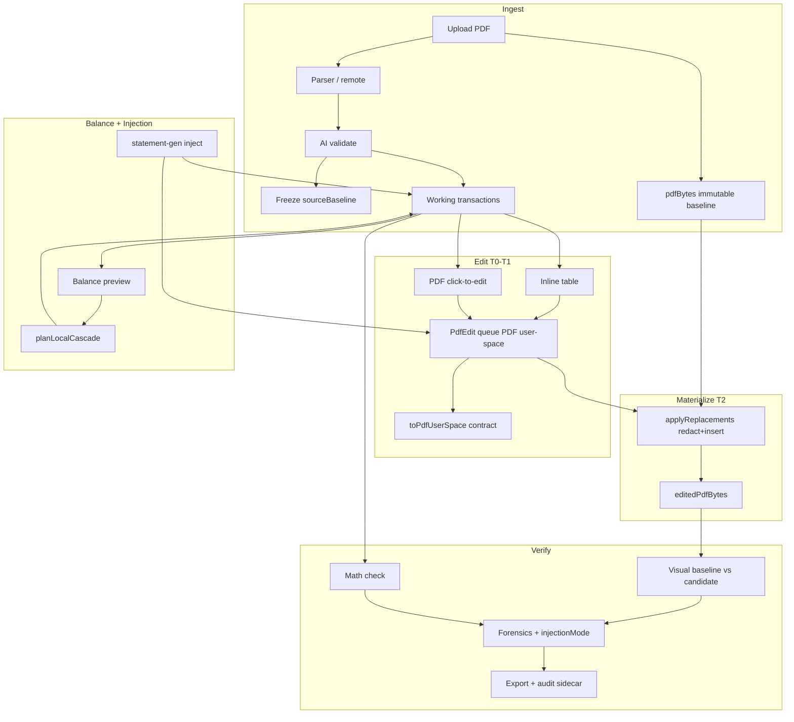
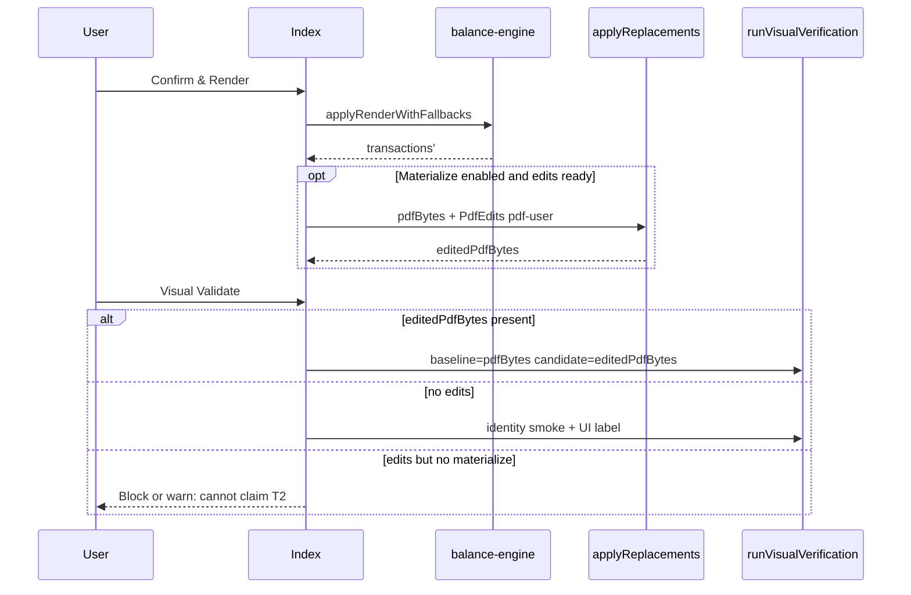

# Integration Design: Bank Statement Fidelity Editor → Statement Lens Web

| Field | Value |
|-------|-------|
| **Document** | Integration Design — Fidelity Editor product suite into Statement Lens |
| **Author** | Systems Architecture (Statement Lens) |
| **Date** | 2026-07-19 |
| **Status** | Draft (Revision 3 — re-review addressed) |
| **Codebase** | `/Users/adminuser/rork-bank-statement-editor-clone/web/` |
| **Stack** | React 19 · Vite 8 · TypeScript (web-only; not Rust/egui dual-core) |
| **Dev server** | http://localhost:8080/ |

---

## Overview

**Product goal.** Enable precise, high-fidelity modification of bank statement PDFs while maximizing **structural and geometric fidelity** to the original document (layout, positions, colors, and best-effort fonts), with **additional generation logic** for mathematically consistent cascades and synthetic transaction descriptions.

**Fidelity is tiered (T0–T3), not absolute.** Web WASM cannot match native PyMuPDF Pro pixel identity. Product language, export banners, and forensics judgments bind to the active **fidelity tier** (see [Fidelity Tier Model](#fidelity-tier-model-t0t3)). “Replica-inject” means **best-effort geometry reuse of original text runs**, not a guarantee of pixel identity.

Users load a statement, perform targeted edits, apply smart balancing with generation logic where needed, then verify through multi-layer checks. Offline fallbacks, batch processing, transaction transfers, date adjustments, and template-driven generation support realistic, audit-ready outputs for **testing, reconstruction, or analysis**, with full audit trails. The product **does not** forge Adobe signatures or commercial watermarks.

**Logic injection core.** Configuration-driven injection → transaction fabricator → calibration → pagination/rendering transforms minimal config into a realistic ledger that can land in the edit table and, when tier ≥ T2 write path is ready, into PDF edit geometry.

**This design** maps Fidelity Editor v0.5.1 onto Statement Lens, specifies coordinate/write contracts required for implementation, closes open product policies as Key Decisions, and orders PRs so users cannot export redaction-only blank holes as “replicas.”

---

## Fidelity Tier Model (T0–T3)

| Tier | Name | What the user gets | When claimed | Forensics expectation |
|------|------|--------------------|--------------|------------------------|
| **T0** | Table-only | Working ledger in UI; original PDF untouched | Default after parse; statement-gen `table-only` | Quantitative/generation layers primary; visual may be identity |
| **T1** | Geometry-linked **preview** | Canvas overlays + `PdfEdit` queue; no durable write claim | Click-to-edit / inject with flag off or write unavailable | Narrative drift OK; do not claim visual pass as export fidelity |
| **T2** | Exported PDF (web best-effort) | Redact + reinsert text (base-14/simple font) or raster stamp; approx fonts | After write path gates pass + export materializes `editedPdfBytes` | Visual SSIM may warn; quantitative + structural matter |
| **T3** | Native / Pro | True font metrics, subsetting, dual-core | **Out of scope** this cycle | Reserved for future |

**UI rules:**

- Export banner and Complete step show active tier badge (`T0` / `T1` / `T2`).
- “Pass” toasts on visual identity checks must say **identity smoke**, not “fidelity verified,” when `editedPdfBytes` is null or equals baseline.
- Mode name `replica-inject` remains; copy documents it as **T1 queue → T2 export when write ready**.

---

## Background & Motivation

### Current state (Statement Lens)

Orchestrated from [`web/src/pages/Index.tsx`](web/src/pages/Index.tsx) (~1739 LOC). After upload:

1. Parse via multi-parser registry ([`parsers/registry.ts`](web/src/lib/parsers/registry.ts)) or remote engine.
2. AI validate/categorize ([`ai.ts`](web/src/lib/ai.ts)).
3. Freeze **`sourceBaseline`** for forensics.
4. Workflow: `edit | balance | render | visual | math | generate | fidelity | complete` ([`types.ts`](web/src/lib/types.ts)).
5. In-place `PdfEdit` queue, balance preview, visual @ 300 DPI, math check, statement-gen, multi-layer forensics.

### Pain points

| Pain | Evidence |
|------|----------|
| Write path redacts only (blank holes) | [`mupdf-engine.ts`](web/src/lib/pdf-engines/mupdf-engine.ts) `applyReplacements` |
| `PdfEdit.bbox` not normalized to PDF user space | Viewer scale **1.4** (`PdfDocumentViewer`); run-match **scale=1** (`pdf-runs.ts`); MuPDF applies raw bbox |
| statement-gen Apply is table-only | Index generate handler; no PdfEdits |
| advancedGenerator already does run-match → PdfEdits | `AdditionalToolsPanel` Generator tab |
| Visual step always identity | Index `candidatePdf: pdfBytes` |
| Confirm & Render is table + engine **probe**, not PDF materialize | `handleConfirmRender` |
| Balance = stated/recompute/hybrid only | `balance-engine.ts` |
| Batch, transfer, Typst, HSBC/Wise, encryption, Advanced Mode | Missing |
| Engine UI label claims “PyMuPDF Pro” but runtime is **mupdf WASM** | [`pdf-engines/types.ts`](web/src/lib/pdf-engines/types.ts) `ENGINE_CHAIN` |

### Why integrate rather than rewrite

Coverage matrix below: **6 implemented · 12 partial · 8 missing** major feature rows (workflow + core + pipeline + tools + gen). That is a substantial working surface; incremental integration is preferred over a dual-core port.

---

## Goals & Non-Goals

### Goals

1. Tiered fidelity framing (T0–T3) as product language — maximize geometric/structural fidelity on web.
2. Coverage matrix of Fidelity features → modules with accurate status.
3. Unified architecture: parse → edit → balance → **materialize PDF** → visual → math → generate (inject) → forensics.
4. Logic injection: statement-gen → table **and** PdfEdit queue with length/anchor policy.
5. **Coordinate contract** + implementable MuPDF write path with acceptance gates.
6. Gap analysis, phased PRs (with export safety before default inject).
7. Key Decisions including policies that previously blocked implementation.
8. Security: no signature/watermark forgery; intended-use + provenance disclosure.

### Non-Goals

- Rust dual-core / egui port now (T3).
- Forging Adobe signatures, DocuSign seals, or commercial bank watermarks.
- Guaranteeing pixel-perfect match to original bank PDFs under WASM.
- Multi-tenant SaaS.
- Replacing cloud parsers wholesale.

---

## Coverage Matrix

Status key: **implemented** · **partial** · **missing**

### Core editing

| Feature | Module | Status | Notes |
|---------|--------|--------|-------|
| Click-to-select bbox replace | `PdfDocumentViewer`, `PdfPageViewer`, `PdfEdit` | **implemented** | Stores scaled coords today — needs PR-00 normalization |
| Preserve metrics (redaction-based) | `mupdf-engine`, canvas overlay | **partial** | Redact-only write; overlay is T1 preview |
| Font analysis / completion / subsetting | `font-analysis`, `matchFontSpec` | **partial** | Analysis OK; no embed/subset |
| Multi-page + txn connectivity | engines + `linkRunMatches` | **partial** | maxPages=8 common; greedy match |

### Workflow stages

| Stage | Module | Status | Notes |
|-------|--------|--------|-------|
| 1. Parse + AI + completeness (+ gap gen) | parsers, `completeness`, `ai` | **partial** | No gap-fill generation yet |
| 2. Inline Edit Table | `TransactionTable`, `edit-utils` | **implemented** | |
| 3. Balance Out Preview + cascade | `balance-engine`, `BalanceOutPreview` | **partial** | No cascade mutator |
| 4. Confirm & Render | `applyRenderWithFallbacks`, Confirm panel | **partial** | Table balances + **engine probe only**; PDF write is separate `handleExportPdf` |
| 5. Visual Validate | `run-visual`, metrics, Applitools | **partial** | Library complete; Index always passes identity candidate |
| 6. Final Math Check | `math-check` | **implemented** | |

### Smart balance

| Feature | Status | Notes |
|---------|--------|-------|
| Detect imbalances | **implemented** | `buildBalancePreview` |
| Minimal cascade (local) | **missing** | PR-04 |
| AI-assisted cascade | **missing** | PR-05 |
| Auto-correct closing while protecting priors | **partial** | Recompute only |

### Multi-backend

| Feature | Status | Notes |
|---------|--------|-------|
| PDF engines MuPDF → Pdfium → PDF.js | **partial** | WASM mupdf **not** Pro; UI string incorrectly says “PyMuPDF Pro” — fix in PR-00 |
| Typst reconstruction | **missing** | P3 |
| Parsers (6) + YAML | **partial** | HSBC/Wise missing |
| AI (Gemini) | **partial** | Primary `openai/gpt-4.1-nano`; Gemini in gateway fallbacks |
| Verification SSIM/tile/pHash + Eyes | **implemented** (local metrics) / **partial** (orchestration identity) | |
| Boot-time API status | **implemented** | `api-status` |

### Batch, audit, tools

| Feature | Status | Notes |
|---------|--------|-------|
| Batch multi-file | **missing** | Needs `DocumentSession` first |
| Thresholds 0.005–0.10, retries 1–10, 300 DPI | **implemented** | |
| Audit / undo / drafts | **implemented** | Draft `version: 1` literal — v2 in PR-00/01 |
| Transfer between PDFs | **missing** | |
| Date shift | **implemented** (table) | No PdfEdit refresh (G14) |
| Font / DocAI / geometry / remote | **partial–implemented** | |
| Root-of-trust encryption | **missing** | |
| Progressive Advanced Mode | **partial** | Tools always visible |
| No signature/watermark forgery | **N/A non-goal** | |

### Statement generation / injection

| Feature | Status | Notes |
|---------|--------|-------|
| Config → fabricator → calibrate → paginate → print | **implemented** | |
| Apply → workspace table | **implemented** | |
| Apply → PDF run-match edits | **partial** | advancedGenerator only; statement-gen missing |

### Forensics

| Feature | Status | Notes |
|---------|--------|-------|
| Multi-layer vs sourceBaseline | **implemented** | |
| injectionMode / gap-fill priors | **missing** | Extend types in PR-01 |

**Matrix tally (major rows above): implemented 6 · partial 12 · missing 8** (approx.; used instead of unmeasured “~70%”).

---

## Proposed Design

### Unifying principle

Two axes at every stage:

1. **Replica fidelity** (tier T0–T2) — geometric reuse of original PDF structure vs `sourceBaseline`.
2. **Generation integrity** — mathematical/calibration consistency of synthetic or cascade-adjusted data.



---

### PdfEdit coordinate contract (PR-00 — blocking)

**Problem.** Producers disagree on space:

| Producer | Scale | Y convention | Used by |
|----------|-------|--------------|---------|
| MuPDF `extractRunsFromPage` | Multiplies user-space by `scale` (viewer often **1.4**) | MuPDF structured-text bbox (top-left style in page space × scale) | Click-to-edit via `PdfPageViewer` |
| PDF.js `getPageTextRunsFromBytes` | Default **scale=1** viewport | PDF.js transform; run-match uses `y: r.y - r.height` | advancedGenerator inject |
| `applyReplacements` | None | Feeds raw `bbox` into `addRedaction` as if PDF user space | Export |

**Contract (required on every `PdfEdit`):**

```ts
/** PDF user space: origin bottom-left (PDF default), units = points, scale=1. */
export type PdfCoordSpace = "pdf-user";

export interface PdfBBox {
  x: number;
  y: number;
  width: number;
  height: number;
}

export interface PdfEdit {
  id: string;
  page: number; // 1-indexed
  runId: string;
  original: string;
  replacement: string;
  /** ALWAYS stored in pdf-user space after PR-00. */
  bbox: PdfBBox;
  fontSpec: PdfFontSpec;
  /** Point size in PDF user space (not viewport pixels). */
  fontSize: number;
  /** Provenance for debugging / migration of pre-PR-00 edits. */
  coordMeta: {
    space: PdfCoordSpace; // always "pdf-user" when persisted post-PR-00
    /** Scale used when extracting the source run (for audit only). */
    sourceViewportScale: number;
    /** Page height in PDF points (MediaBox), for Y flips if needed. */
    pageHeightPts: number;
    producer: "mupdf-viewer" | "pdfjs-runs" | "inject" | "manual";
  };
  linkedTransactionId?: string;
  linkedField?: EditableField;
}
```

**Normalization helpers** (`web/src/lib/pdf-engines/coords.ts`):

```ts
/** Convert MuPDF structured-text span (already × scale) → pdf-user. */
export function mupdfScaledRunToPdfUser(
  run: { x: number; y: number; width: number; height: number; fontSize: number },
  scale: number,
  pageHeightPts: number,
): { bbox: PdfBBox; fontSize: number };

/** Convert PDF.js viewport item → pdf-user (invert viewport transform / divide scale). */
export function pdfJsRunToPdfUser(
  run: ExtractedRun,
  scale: number,
  pageHeightPts: number,
): { bbox: PdfBBox; fontSize: number };

/** Identity assert: space must be pdf-user before write. */
export function assertPdfUserSpace(edit: PdfEdit): void;

/** Write-time: bbox is already pdf-user; build MuPDF rect [x0,y0,x1,y1]. */
export function toMuPdfRect(bbox: PdfBBox): [number, number, number, number];
```

**Rules:**

1. **Only final `PdfEdit.bbox` must be pdf-user.** Intermediate match runs stay in **producer-native** form through `linkRunMatches` (see pipeline below). Conversion happens **once**, when constructing `PdfEdit`.
2. `applyReplacements` **asserts** `coordMeta.space === "pdf-user"` and never divides by viewer scale.
3. Unit tests on a fixture PDF: replace known string at known user-space rect; re-extract runs; center of replacement within 1 pt of original span center.

#### Run → match → PdfEdit pipeline (no double Y-shift)

**Bug to avoid:** Today `linkRunMatches` always does `y: r.y - r.height` assuming PDF.js **baseline-style** run Y (`run-match.ts`). If code converts to pdf-user axis-aligned boxes *before* matching, that second `y - height` shifts every redaction by one line height.

**Chosen pipeline (preferred):**

| Stage | Object | Coordinate space | Who transforms |
|-------|--------|------------------|----------------|
| 1. Extract | `ExtractedRun` / MuPDF `TextRun` | **Producer-native** (PDF.js baseline+scale, or MuPDF×viewer scale) | `getPageTextRunsFromBytes` / `renderPage` only |
| 2. Match | `RunMatch` | Still **producer-native** geometry; `linkRunMatches` may apply **at most one** baseline adjust when `runSpace: "pdfjs-baseline"` (default) | `linkRunMatches` |
| 3. Build edit | `PdfEdit` | **pdf-user** only | `buildFontReplicatedReplacements` / `runMatchToPdfEdit` calls `pdfJsRunToPdfUser` or `mupdfScaledRunToPdfUser` **once** |

```ts
// linkRunMatches — explicit space; never convert to pdf-user here
export function linkRunMatches(params: {
  transactions: Transaction[];
  runs: ExtractedRun[]; // producer-native
  preferOriginal?: boolean;
  /** Default "pdfjs-baseline": apply y - height once when building RunMatch.bbox.
   *  "raw": use x,y,width,height as-is (MuPDF structured-text top-left × scale). */
  runSpace?: "pdfjs-baseline" | "raw";
}): { matches: RunMatch[]; stats: ... }

// Inside linkRunMatches when emitting bbox:
const runSpace = params.runSpace ?? "pdfjs-baseline";
const bbox =
  runSpace === "pdfjs-baseline"
    ? { x: r.x, y: r.y - r.height, width: r.width, height: r.height }
    : { x: r.x, y: r.y, width: r.width, height: r.height };
// Store runSpace + source scale on RunMatch for the converter:
// match.nativeBbox, match.runSpace, match.fontSize (viewport), match.page
```

```ts
// buildFontReplicatedReplacements / inject — sole conversion site
for (const m of runMatches) {
  const pageH = pageHeightByPage[m.page];
  const { bbox, fontSize } = convertNativeMatchToPdfUser(m, pageH);
  // convertNativeMatchToPdfUser:
  //   if m came from pdfjs: pdfJsRunToPdfUser uses match geometry WITHOUT re-applying y-height
  //   if m came from mupdf viewer: mupdfScaledRunToPdfUser divides by sourceViewportScale
  edits.push({
    ...,
    bbox, // pdf-user
    fontSize,
    coordMeta: {
      space: "pdf-user",
      sourceViewportScale: m.sourceScale ?? 1,
      pageHeightPts: pageH,
      producer: m.producer ?? "inject",
    },
  });
}
```

**Forbidden:** `runs.map(pdfJsRunToPdfUser)` then `linkRunMatches` with default `pdfjs-baseline` (double shift).

**Fixture (PR-00 + PR-01):** known PDF.js item → `linkRunMatches` → `buildFontReplicatedReplacements` → PdfEdit center within **1 pt** of true MediaBox span (same bar as write-path A gates).

**Y-axis note:** MuPDF redaction rects use page coordinates consistent with `getBounds()` / unscaled structured-text. Converters strip viewport scale **once** at PdfEdit construction; if PDF.js Y origin differs from MuPDF, flip using `pageHeightPts` only in that converter.

---

### PDF engine write path (PR-02) — concrete API

**Current (verified):** thin `MuPdfPage` with `addRedaction` + `applyRedactions` only; no text draw. Typed package `mupdf@1.28.0` (`mupdf.d.ts`):

| API | Role |
|-----|------|
| `PDFPage.createAnnotation("Redact" \| "FreeText")` | Redact + FreeText insert |
| `PDFAnnotation.setRect` / `setContents` / `setDefaultAppearance` / `update` | FreeText body |
| `PDFPage.applyRedactions(...)` | Burn redactions |
| `PDFDocument.addSimpleFont` / `addFont` / `addStream` / `addRawStream` / `findPage` | Low-level write |
| `PDFObject.get` / `put` / `writeStream` | Mutate page dict / contents |
| `Text.showString`, `Device.fillText` | **Render devices only** — not durable page content unless operators are written into `/Contents` |

#### v1 primary (shippable): Redact + FreeText TypeWriter

There is **no** high-level “draw string on page contents” in mupdf 1.28. Content-stream rewrite is R&D. **v1 primary path is FreeText** (implementable from the typed API). Content-stream is **v1.1 research** (optional stretch), not the default claim for T2 until proven.

```ts
// PR-02 v1 — MuPdfDocument.applyReplacements (post PR-00)
async applyReplacements(replacements: PdfEditLike[]): Promise<Uint8Array> {
  const pdfDoc = this.doc as PDFDocument; // typed mupdf document
  for (const [pageNum, list] of groupByPage(replacements)) {
    const page = pdfDoc.loadPage(pageNum - 1) as PDFPage;

    // 1) Redact original glyphs
    for (const r of list) {
      assertPdfUserSpace(r);
      const rect = toMuPdfRect(r.bbox); // [x0, y0, x1, y1] pdf-user
      const red = page.createAnnotation("Redact");
      red.setRect(rect);
      // optional: red.setContents("") ; appearance defaults white fill via applyRedactions
      red.update();
    }
    page.applyRedactions(/* black_boxes */ false);

    // 2) Insert replacement text (v1 primary = FreeText)
    for (const r of list) {
      insertFreeTextTypeWriter(page, r);
    }

    // 3) KD13 signature strip once per materialize (see below)
  }
  stripSignatureInfrastructure(pdfDoc); // no-op if none
  return pdfDoc.saveToBuffer(/* or saveAsBuffer */) as Uint8Array;
}

function insertFreeTextTypeWriter(page: PDFPage, r: PdfEditLike): void {
  const ann = page.createAnnotation("FreeText");
  ann.setRect(toMuPdfRect(r.bbox));
  ann.setContents(r.replacement);
  // fontName must match a resource FreeText can resolve; Helvetica is safe
  const size = Math.max(6, Math.min(r.fontSize || 9, 24));
  ann.setDefaultAppearance("Helv", size, [0, 0, 0]);
  // Intent TypeWriter if API exposes setIntent("FreeTextTypeWriter")
  ann.update();
}
```

**Capability probe:** `"createAnnotation" in page` / load via typed `PDFDocument`. Replace informal `addRedaction` wrapper with `createAnnotation("Redact")` when present.

#### v1.1 research (not blocking v1 flag): content-stream append

Optional spike after FreeText gates pass. Concrete steps if pursued:

```
1. pageObj = pdfDoc.findPage(pageIndex)
2. fontRef = pdfDoc.addSimpleFont(new Font("helv"), "Latin")
3. Ensure pageObj.Resources.Font maps e.g. /FHelv → fontRef (get/put)
4. contents = pageObj.get("Contents")  // stream | array | null
5. Build operator buffer (PDF text object), using pdf-user baseline:
     BT /FHelv <size> Tf <x> <y> Td (<escaped replacement>) Tj ET
   Baseline y ≈ bbox.y (bottom of pdf-user box) or bbox.y + descender fudge
6. newStream = pdfDoc.addStream(operatorBytes, { Filter: null })
7. If Contents is array: put array + [newStream]; if single stream: put [old, newStream]
   Failure modes: compressed streams (must decode or always append sibling stream);
   Form XObject-only text (skip page, fall back FreeText); encrypted docs (abort)
8. page.update() if required; save buffer
```

`Device.fillText` / `Text.showString` remain **out of band** for durable edits unless a future mupdf API records them into content.

#### v1.1 optional: raster stamp (money fields)

Canvas web-font draw → `addImage` / image XObject over bbox when FreeText SSIM fails money fields. User-visible “image stamp” badge.

#### Signature strip (KD13) — MuPDF sketch

Run on every successful materialize when `replacements.length > 0`:

```
function stripSignatureInfrastructure(pdfDoc: PDFDocument): { stripped: boolean; detail: string } {
  const trailer = pdfDoc.getTrailer?.() ?? pdfDoc /* probe */
  let stripped = false

  // 1) AcroForm fields with FT == Sig
  const acro = trailer.get?.("Root")?.get?.("AcroForm")  // or pdfDoc.find path
  if (acro) {
    const fields = acro.get("Fields") // array
    // Filter out field dicts where /FT == /Sig; null out Widget annots on pages
    // with Subtype /Widget and FT /Sig or Parent chain to Sig
    // put remaining Fields; if empty, Root.put("AcroForm", null) or delete
    stripped = true if any removed
  }

  // 2) Clear document-level /Perms (DocMDP) if present on Root
  // Root.put("Perms", null)

  // 3) Incremental update: full save (not incremental) so old xref sig bytes
  //    are not the only revision — use non-incremental save API if available

  // 4) No-op if no AcroForm / no Sig fields — stripped=false; do NOT audit event
  return { stripped, detail }
}
```

- **Audit:** emit `export.signatures_stripped` **only when** `stripped === true`.
- **Test:** synthetic PDF with `/AcroForm` + one `/FT /Sig` field (can be unsigned placeholder); after materialize, extract shows no Sig field; unsigned docs unchanged.
- **Honest limit:** Byte-level “forensic wipe” of all historical incremental revisions is **not** guaranteed in browser WASM; goal is **no valid-looking signature widgets** on the exported file.

**Acceptance criteria (must pass before `mupdfTextInsert` default on):**

| # | Gate |
|---|------|
| A1 | Fixture: replace `"100.00"` → `"200.00"`; `extractPageText` / annotation contents contain `200.00` |
| A2 | No white void larger than bbox+2pt without replacement text/annot |
| A3 | Identity export (empty replacements) SSIM ≥ 0.99 vs baseline |
| A4 | Browser vitest fixture under `web/src/test/` using small synthetic PDF |
| A5 | Export UI shows tier **T2** only when A1–A4 green for session engine |
| A6 | Signature-strip test: synthetic AcroForm Sig removed; clean PDF no-op |

**Flag:** `statement-lens.flag.mupdfTextInsert` default **off** until FreeText path passes A1–A6. Content-stream is **not** required for flag enablement.

---

### Session PDF state: `editedPdfBytes`

Index currently has `pdfBytes` (source) only. Export mutates ephemerally; visual never sees it.

```ts
// Index / DocumentSession fields
pdfBytes: Uint8Array | null;           // immutable source baseline PDF
editedPdfBytes: Uint8Array | null;     // last successful materialize
lastMaterializeMeta: {
  engineUsed: EngineId;
  editCount: number;
  tier: "T2";
  at: string; // ISO
  textInsert: boolean; // mupdfTextInsert was on and used
} | null;
```

**When to materialize:**

| Trigger | Behavior |
|---------|----------|
| **Export PDF** | Always attempt materialize; if text-insert unavailable and edits>0 → **hard block** or modal (see Export guards) |
| **Confirm & Render** | (1) apply balance engines to table; (2) rebuild money-field PdfEdits; (3) **optional** materialize if flag on and user checked “Materialize PDF for visual” |
| **Before Visual** | If `pdfEdits.length > 0` and `editedPdfBytes` null/stale → materialize or refuse visual-as-fidelity |
| **Stale** | Any `setPdfEdits` / table cascade that changes linked fields clears `editedPdfBytes` |

**Confirm & Render definition (corrected):**

- **Render (balance)** = `applyRenderWithFallbacks` on transactions (existing).
- **Materialize (PDF)** = `applyReplacementsWithFallbacks(pdfBytes, normalizedEdits)` → `editedPdfBytes`.
- Engine **probe** alone is not “render complete” for fidelity claims.



---

### Generate / logic injection (complete algorithm)

**Modes** (single source of truth — drop redundant `linkPdfGeometry` boolean):

```ts
export type InjectionMode = "table-only" | "replica-inject" | "print-synthetic";
// "none" is not an apply mode; use absence of generate apply
```

| Mode | Table | PdfEdits | Tier |
|------|-------|----------|------|
| `table-only` | Replace working set | Unchanged / cleared optional | T0 |
| `replica-inject` | Replace per pairing policy | Queue geometry edits | T1 → T2 on materialize |
| `print-synthetic` | Optional apply | None — StatementPrintView | T0 print |

**Key Decision 11 — length / pairing policy (was Open Question 1):**

1. **Default for `replica-inject`:** require **pairable rows** via one of:
   - **Same length:** pair by index (advancedGenerator behavior), or
   - **Anchor match:** same `date` + normalized `description` (first unmatched).
2. If generated length ≠ previous length **and** anchor match covers **&lt; 50%** of `min(prev, gen)` rows → **refuse replica-inject**, force `table-only` with toast explaining row-count mismatch.
3. Optional user override “Inject overlapping anchors only” (Advanced Mode) pairs only anchors; unpaired generated rows are table-only (no PdfEdit).
4. advancedGenerator is **refactored** to call the same `inject.ts` helper (no dual pipelines).

**`injectGenerationIntoWorkspace` algorithm:**

```
async function injectGenerationIntoWorkspace(params):
  previous = snapshot(params.previous)           // (1) before replace
  generated = params.generated
  mode = params.mode

  if mode == print-synthetic:
    return { transactions: generated, pdfEdits: [], stats, mode }

  if mode == table-only OR !params.pdfBytes:
    return { transactions: flag(generated), pdfEdits: [], stats, mode: table-only }

  // mode == replica-inject — HARD: export refuse path must already exist (PR-02 merged)
  assert params.pdfBytes
  assert exportRefusePathPresent()  // compile-time / runtime guard helper from PR-02

  pairing = pairRows(previous, generated)        // index and/or anchors → PairingEdge[]
  if pairing.coverage < 0.5:
    toast force table-only; return table-only result

  pageHeightByPage = probePageHeights(pdfBytes)
  // (2) Extract in PRODUCER-NATIVE space — do NOT pdfJsRunToPdfUser here
  runs = await getPageTextRunsFromBytes(pdfBytes, maxPages=8, scale=1)
  // maxPages=8 matches visual/tools memory budget

  // (3) Match on native runs; baseline adjust at most once inside linkRunMatches
  { matches, stats } = linkRunMatches({
    transactions: previous,
    runs,                          // native ExtractedRun[]
    preferOriginal: true,
    runSpace: "pdfjs-baseline",    // y - height once; not pdf-user yet
  })
  // Money fields: require score >= 0.95 (exact); text >= 0.5

  // (4) Pair with explicit edges (index and/or anchors)
  paired = pairGeneratedToMatches({
    previous, generated, matches,
    pairing: pairing.edges,        // { prevIdx, genIdx }[]
  })

  // (5) Build PdfEdits — SOLE conversion to pdf-user (coordMeta + fontSize)
  edits = buildFontReplicatedReplacements({
    transactions: generated,
    runMatches: paired,
    pageHeightByPage,
    producer: "inject",
    sourceViewportScale: 1,
  })

  if edits.length == 0 OR stats.linked / stats.fields < 0.25:
    warn low link-rate; still allow table replace; pdfEdits=[]

  transactions = flag(generated, ["statement-gen", "replica-inject", ...])
  pdfEdits = mergeEdits(params.existingEdits, edits)  // replace same runId; append else
  audit generate.apply + pdf.edits.linked with stats
  clear editedPdfBytes (stale)
  return { transactions, pdfEdits, stats, mode }
```

**Edit merge strategy:** Key by `runId`; new wins. Also drop edits whose `linkedTransactionId` no longer exists.

**UI (StatementGeneratorDashboard):**

- Mode segmented control: Table only | Replica-inject | Print synthetic.
- Replica-inject **disabled** when `!pdfBytes` (tooltip: “Upload a PDF”).
- Replica-inject **requires PR-02 export guards merged**; still default flag **off**. T1 preview-only may queue edits only if `canRefuseBlankHoleExport()` is true.
- Show `stats` string under Apply: `Run-match: L/F fields · E edits · R runs · coverage C%`.

**Index wiring:**

```ts
onApplyToWorkspace={async (txns, label, options) => {
  const result = await injectGenerationIntoWorkspace({
    previous: transactions,
    generated: txns,
    pdfBytes,
    existingEdits: pdfEdits,
    mode: options?.mode ?? "table-only",
  });
  // undo snapshot, setTransactions, setPdfEdits, audit, tier badge
}}
```

---

### Export guards (blank-hole prevention)

**Hard rules:**

1. If `pdfEdits.length > 0` AND text-insert path **unavailable** (flag off or FreeText/write path cannot run):
   - **Refuse** `handleExportPdf` download of redaction-only buffer.
   - Modal: “Export would remove original text without rewriting glyphs (blank holes). Enable write path experimental flag after gates pass, or clear PDF edits and export table CSV/JSON only.”
   - Audit: `pdf.export.blocked`.
2. If text-insert available: export allowed → tier **T2** banner on success.
3. **Merge dependency (hard):** **Do not merge PR-01** unless PR-02’s refuse path is already on `main` (or PR-01 includes an identical guard in the same merge train). Prefer single implementation: `canMaterializeWithTextInsert()` + `assertExportSafe(pdfEdits)` in `pdf-engines/export-guards.ts` landed in **PR-02**, imported by Index and inject.
4. PR-01 may queue PdfEdits only when:
   - export refuse path present (`assertExportSafe` imported from PR-02 module), **and**
   - `replicaInject` flag on, **and**
   - (`mupdfTextInsert` on **or** user opts into **T1 preview-only** knowing export is blocked until insert works).
5. Default flags at ship of PR-01: `replicaInject=false`, `mupdfTextInsert=false`.

---

### Balance cascade (local min-edit) — full algorithm

**Role:** Cascade is a **one-shot mutator** that produces a new `Transaction[]`, not a fourth `BalanceEngineId`. Preview still uses stated/recompute/hybrid; cascade **applies** changes the user confirms.

**Key Decision 12 — cascade defaults (was Open Question 2):**

| Setting | Default |
|---------|---------|
| Objective | Minimize **number of field edits**, then Σ|Δ| as tie-break |
| Default fix mode | **`balances-only`** (recompute running balances from opening; do not change debit/credit) |
| Amount edits | Off unless user enables “Allow amount edits” |
| Synthetic rows | Off unless “Allow synthetic balancing row” |
| Immutable priors | Opening-balance marker rows + any `flags` containing `immutable`; optional UI multi-select |
| Target closing | If set, after chain fix, adjust **last non-immutable** balance or add synthetic fee/interest |

**Objective (formal):**

```
minimize (N_edits, Σ|Δ_amount|, Σ|Δ_balance|)
subject to:
  ∀i not immutable: balance[i] = balance[i-1] + credit[i] - debit[i]  (± TOL 0.05)
  optional: balance[last] = targetClosing
```

**Pseudocode:**

```
function planLocalCascade(txns, opts): CascadePlan
  open = inferOpeningBalance(txns)
  TOL = 0.05
  adjustments = []
  working = clone(txns)

  if opts.mode == "balances-only" OR !opts.allowAmountEdits:
    // Equivalent to recompute engine materialize
    expected = recomputeBalances(working, open)
    for i, t in working:
      if t.id in immutable: continue
      if expected[i] != null AND not moneyEqual(t.balance, expected[i], TOL):
        adjustments.push({ id, field: "balance", from: t.balance, to: expected[i], reason: "recompute-chain" })
        working[i].balance = expected[i]
    return plan from adjustments

  // allowAmountEdits: walk chain; at first mismatch prefer smallest single-field fix
  running = open
  for i, t in working:
    if running == null: running = t.balance; continue
    expected = round2(running + movementOf(t))
    if t.balance != null AND abs(t.balance - expected) <= TOL:
      running = t.balance
      continue
    if t.id in immutable:
      // re-anchor
      running = t.balance ?? expected
      continue
    // Candidate fixes:
    // F1: set balance = expected (1 edit)
    // F2: if stated balance S: adjust debit or credit by (expected - S) opposite sign (1 edit)
    // pick F1 if balances-preferred else min |delta| among F1/F2
    apply chosen; record adjustment; running = new balance

  if opts.targetClosing != null AND last balance off:
    if opts.allowSyntheticRows:
      insert synthetic row before close with amount to hit target
      description = "BALANCING ADJUSTMENT", category = Fees, flags = [cascade, synthetic, statement-gen]
      date = last.date or periodEnd
    else:
      adjust last mutable debit/credit/balance

  validate: buildBalancePreview(working, "recompute").chainHealthy
  return plan
```

**Worked examples:**

| # | Scenario | Plan |
|---|----------|------|
| E1 | Single balance typo row 5 | balances-only: set bal[5..] recompute from open (or from last healthy anchor if hybrid preview used for display only) |
| E2 | Wrong debit on row 3, later balances correct (hybrid re-anchor) | With amount edits: fix debit so chain matches next stated balance; minimize |Δ| |
| E3 | Empty balances all rows | balances-only fill from open + movements |
| E4 | Missing intermediate day (gap) | synthetic off → cannot invent; report fail + suggest gap-fill PR-06 |
| E5 | targetClosing 100 below | synthetic fee row `BALANCING ADJUSTMENT` 100.00 debit on last date |

**Interaction with engines:** Preview dropdown unchanged. “Apply cascade” uses plan above; then optional PdfEdit rebuild for balance fields (PR-12).

**Tests (PR-04):** unit fixtures for E1–E5 before UI wire-up.

---

### Forensics + injectionMode

Extend `ForensicInput` / report:

```ts
injectionMode: InjectionMode | "none";
fidelityTier: "T0" | "T1" | "T2";
gapFillCount: number;
```

`analyzeGenerationLogic`:

- Treat flags `gap-fill`, `cascade`, `synthetic`, `statement-gen` as **intentional** (do not score as authenticity failure).
- When `injectionMode === "replica-inject"`, lower weight on narrative/source-alignment; raise generation-consistency expectation.
- Markdown section: **Injection & tier** with mode, tier, link stats if any.

---

### Multi-document model (batch / transfer)

**Before PR-07 implementation**, land architecture:

```ts
interface DocumentSession {
  id: string;
  fileName: string;
  pdfBytes: Uint8Array | null;
  editedPdfBytes: Uint8Array | null;
  transactions: Transaction[];
  sourceBaseline: Transaction[];
  pdfEdits: PdfEdit[];
  workflowStep: WorkflowStep;
  injectionMode: InjectionMode | "none";
  fidelityTier: "T0" | "T1" | "T2";
  parserId: DocumentParserId | null;
}
```

- Index refactors toward `activeSessionId` + `sessions: Map<id, DocumentSession>` (can be incremental).
- Batch queue: process N files with **max concurrent 1** default; memory cap: do not keep 300 DPI bitmaps for all sessions — only active.
- Transfer (PR-08): copy selected txns from session A → B; recompute B balances; optional inject on B’s pdfBytes.

PR-07 split: **PR-07a spike** (DocumentSession extract) · **PR-07b** multi-file UI.

---

## API / Interface Changes

```ts
// types.ts — InjectionMode, PdfEdit.coordMeta, fontSize (see coordinate contract)

export type InjectionMode = "table-only" | "replica-inject" | "print-synthetic";

export interface ApplyGeneratedOptions {
  mode: InjectionMode;
  preserveRowCount?: boolean; // advanced: slice gen to previous.length
}

export interface CascadeOptions {
  allowAmountEdits: boolean;      // default false
  allowSyntheticRows: boolean;    // default false
  immutableTransactionIds: string[];
  targetClosing?: number;
  balancesOnly: boolean;          // default true
}

export interface PairingEdge {
  prevIdx: number;
  genIdx: number;
  reason: "index" | "anchor-date-desc";
}

// --- Shared helper deltas (PR-00 / PR-01) ---

// tools/run-match.ts
export function linkRunMatches(params: {
  transactions: Transaction[];
  runs: ExtractedRun[];
  preferOriginal?: boolean;
  /** Default "pdfjs-baseline". Never pass pdf-user boxes here. */
  runSpace?: "pdfjs-baseline" | "raw";
}): { matches: RunMatch[]; stats: { linked: number; fields: number; runs: number } };

export function pairGeneratedToMatches(params: {
  previous: Transaction[];
  generated: Transaction[];
  matches: RunMatch[];
  /** Required for non-index pairing; if omitted, legacy index-only by previous id map. */
  pairing?: PairingEdge[];
}): RunMatch[];
// When pairing provided: only emit matches whose prevIdx→genIdx edge exists;
// remap transactionId to generated[genIdx].id.

// tools/advanced-generator.ts
export function buildFontReplicatedReplacements(params: {
  transactions: Transaction[];
  runMatches?: FontRunMatch[];
  donorFont?: PdfFontSpec;
  clearEmpty?: boolean;
  /** Required post-PR-00: page height pts for Y conversion. */
  pageHeightByPage: Record<number, number>;
  producer: PdfEdit["coordMeta"]["producer"];
  sourceViewportScale?: number; // default 1 for pdfjs extract
}): PdfEdit[];
// ALWAYS returns pdf-user bbox + fontSize + coordMeta.
// Performs the single native→pdf-user conversion (never assumes match.bbox is pdf-user).

// statement-gen/inject.ts
export async function injectGenerationIntoWorkspace(params: {
  previous: Transaction[];
  generated: Transaction[];
  pdfBytes: Uint8Array | null;
  existingEdits: PdfEdit[];
  mode: InjectionMode;
}): Promise<{
  transactions: Transaction[];
  pdfEdits: PdfEdit[];
  stats: string;
  mode: InjectionMode;
  pairingCoverage: number;
}>;

// pdf-engines/coords.ts — converters (PR-00)
// pdf-engines/export-guards.ts — assertExportSafe, canMaterializeWithTextInsert (PR-02)
// balance-cascade.ts — planLocalCascade, applyCascadePlan (PR-04)
// audit/events.ts — const event names (PR-01)
```

---

## Data Model Changes

### WorkflowDraft v2

```ts
export interface WorkflowDraft {
  version: 1 | 2;
  kind: "statement-lens.workflow";
  path: "audit/workflow.json";
  savedAt: string;
  fileName: string;
  parserId: DocumentParserId | null;
  workflowStep: WorkflowStep;
  transactions: Transaction[];
  auditLog: AuditLogEntry[];
  changeHistory: ChangeHistoryEntry[];
  thresholds: VerificationThresholds;
  pixelReportSummary: { ... } | null;
  mathSummary: { ... } | null;
  meta: {
    pageCount: number;
    limitedExtraction: boolean;
    completenessOverall: number | null;
    // v2:
    injectionMode?: InjectionMode | "none";
    fidelityTier?: "T0" | "T1" | "T2";
    pdfEditCount?: number;
    cascadePlanId?: string | null;
    editedPdfPresent?: boolean;
  };
}
```

**Loader:** `version: 1 | 2`; `migrateV1toV2(d)` fills `injectionMode: "none"`, `fidelityTier: "T0"`, `pdfEditCount: 0`. Reject unknown versions. Tests in same PR that first writes v2 fields (PR-01).

### Transaction flags (standardized)

`edited` · `rendered` · `generated` · `statement-gen` · `gap-fill` · `date-shifted` · `cascade` · `synthetic` · `replica-inject` · `immutable`

---

## Alternatives Considered

### A1. Full Rust dual-core + native Pro
Reject this cycle (cost vs web investment).

### A2. Always Typst/HTML reconstruct
Reject as primary; keep `print-synthetic` only (cannot claim original layout).

### A3. Remote-only apply-edits
Optional later; not default (privacy/offline).

### A4. AI-only balance
Reject as sole path; local cascade mandatory.

### A5. pdf-lib (pure JS) content-stream rewrite
| Pros | Cons |
|------|------|
| No MuPDF write API friction; good ecosystem | Second PDF stack; font embedding still hard; duplicate load path |

**Decision:** Not primary; evaluate if MuPDF content-stream path fails gates.

### A6. FreeText annotation overlay only
| Pros | Cons |
|------|------|
| Easy via `createAnnotation("FreeText")` + setRect/setContents/setDefaultAppearance | Looks non-native; print/flatten quirks |

**Decision:** **v1 primary** write path (only fully specified high-level API). Content-stream demoted to v1.1 research.

### A7. Rasterize-and-restamp (canvas → image XObject over bbox)
| Pros | Cons |
|------|------|
| Often best SSIM for money glyphs with web fonts | Not selectable text; larger files; forensics “authenticity” may flag images |

**Decision:** **Optional v1.1** for money fields if base-14 SSIM fails gates; user-visible “image stamp” badge.

### Write-path default for PR-02 v1
**Redaction + FreeText TypeWriter** (`createAnnotation`); content-stream append is **v1.1 spike**; raster stamp opt-in for money fields if SSIM fails. Remote Pro apply remains future opt-in (A3).

---

## Security & Privacy Considerations

| Topic | Design |
|-------|--------|
| **Intended use** | Testing, reconstruction, analysis, demo data — **not** production fraud or misrepresentation of bank-issued documents |
| **Threat model** | Sensitive financial PDFs in-browser; cloud parsers/AI when configured; misuse of high-fidelity exports |
| **Disclosure** | Export modal: edits invalidate bank/digital signatures; document may not be accepted as original |
| **Signatures (Key Decision 13)** | **Strip** AcroForm/signature dictionary widgets on materialize when any edit applied (prefer no false trust). Log `export.signatures_stripped`. Do not attempt to re-sign or forge |
| **Watermarks** | Never clone commercial watermark assets; redaction may remove overlapping marks — warn if detected |
| **Provenance** | Default: offer **audit sidecar** JSON download bundled with edited PDF (`*-audit.json` via `buildMergedAuditReport`); recommend always-on for T2 exports |
| **Audit immutability** | Append-only `AuditLogEntry`; drafts may snapshot but log entries never mutate |
| **Root-of-trust (PR-10)** | Optional passphrase AES-GCM for drafts + bytes; passphrase not stored |
| **Cloud** | ApiStatusPanel discloses keys; offline path preferred |

---

## Observability

### Audit event taxonomy (`audit/events.ts`)

Extend `AuditEventType` (keep existing; add):

```ts
| "generate.apply"
| "pdf.edits.linked"
| "pdf.edits.cleared"
| "pdf.materialize"
| "pdf.export.blocked"
| "cascade.apply"
| "export.signatures_stripped"
| "inject.mode_forced_table"
```

PR-01 stops overloading `"note"` for generate/link.

### DEV spans

```ts
if (import.meta.env.DEV) console.debug("[span]", name, performance.now() - t0)
```

for parse, inject, materialize, visual.

### Latency targets (unchanged, now measurable)

| Op | Target |
|----|--------|
| Offline parse ≤10 pages | &lt; 3s |
| Visual 4 pages @ 300 DPI | &lt; 15s |
| statement-gen 30-day | &lt; 50ms |
| run-match ≤8 pages | &lt; 2s |

---

## Rollout Plan

| Flag | Default | Notes |
|------|---------|-------|
| `statement-lens.flag.mupdfTextInsert` | **off** | On after FreeText A1–A6 |
| `statement-lens.flag.replicaInject` | **off** | On only when write path ready **or** T1 preview-only with export block |
| `statement-lens.flag.cascadeLocal` | off until PR-04 tests green | |

**Order:** PR-00 → PR-02 (write) + export guards → PR-01 (inject, default off) → PR-03 (visual candidate) → PR-04 (cascade).  
Do **not** default replica-inject before safe export semantics.

**Rollback:** flags off; clear PdfEdits; table workflow unaffected.

---

## Gap Analysis

| ID | Gap | Priority | Effort | PR |
|----|-----|----------|--------|-----|
| G0 | PdfEdit coordinate contract | **P0** | M | PR-00 |
| G1 | MuPDF redact+FreeText insert write path (content-stream v1.1) | **P0** | **L** (FreeText) / XL (content-stream later) | PR-02 |
| G2 | statement-gen → PdfEdit inject | **P0** | M | PR-01 |
| G3 | Visual uses identity candidate | **P0** | S | PR-03 |
| G3b | Export blank-hole guard | **P0** | S | PR-02 / PR-01 |
| G4 | Local cascade | **P1** | M | PR-04 |
| G5 | AI cascade | **P2** | M | PR-05 |
| G6 | Gap-fill generation | **P2** | M | PR-06 |
| G7 | Batch multi-file | **P1** | **XL** (spike M + impl L) | PR-07a/b |
| G8 | Transfer | **P2** | M | PR-08 |
| G9 | HSBC/Wise YAML | **P2** | S | PR-09 |
| G10 | Typst | **P3** | L | PR-13 |
| G11 | Encryption | **P2** | M | PR-10 |
| G12 | Advanced Mode UI | **P2** | S | PR-11 |
| G13 | Font subset embed | **P3** | XL | Research |
| G14 | Relink PdfEdits after tools | **P1** | S | PR-12 |
| G15 | Desktop CLI | **P3** | XL | Non-goal |

---

## Key Decisions

1. **Web-first incremental integration** — matrix shows majority surface exists; avoid dual-core port.
2. **Tiered fidelity T0–T3** — replace absolute “exact replica” claims; replica-inject = best-effort geometry reuse.
3. **Three apply modes** — `table-only` | `replica-inject` | `print-synthetic` (single source of truth).
4. **Reuse run-match + font replacement helpers** — one `inject.ts` for statement-gen and advancedGenerator.
5. **Local cascade mandatory; AI optional** — offline, testable.
6. **Write path v1 = redact + FreeText TypeWriter (shippable API); content-stream = v1.1 research; raster optional** — see A5–A7.
7. **No Typst on replica critical path**.
8. **No signature/watermark forgery; strip signature dicts on edited materialize**.
9. **`sourceBaseline` frozen at first successful parse**.
10. **Core order: coordinates → safe write/export → inject → visual candidate → cascade** (not inject-before-write). **PR-01 hard-depends on PR-02** export refuse module — not “preferred.”
11. **replica-inject pairing:** same-length index or date+description anchors; &lt;50% coverage forces table-only.
12. **Cascade defaults:** balances-only; min field-edit count; synthetic off; amount edits opt-in.
13. **Signatures:** strip on edit materialize; warn; never re-sign.
14. **PdfEdit always pdf-user space** with `coordMeta` + `fontSize`.
15. **`editedPdfBytes` session field** for visual/forensics/export.

---

## Open Questions (non-blocking)

1. ~~Row count policy~~ → **KD 11**.
2. ~~Cascade default~~ → **KD 12**.
3. ~~Signature dictionaries~~ → **KD 13**.
4. **Remote `/v1/apply-edits` this phase?** — deferred; local write first. (needs product timing only)
5. **Advanced Mode unlock:** simple toggle vs passphrase — default **simple toggle** in PR-11 unless security review prefers passphrase.

---

## References

| Resource | Path |
|----------|------|
| Orchestration | `web/src/pages/Index.tsx` |
| Types / PdfEdit | `web/src/lib/types.ts` |
| Balance | `web/src/lib/balance-engine.ts` |
| Statement gen | `web/src/lib/statement-gen/*`, `web/docs/statement-generation-concepts.md` |
| Run-match | `web/src/lib/tools/run-match.ts` |
| Advanced generator | `web/src/lib/tools/advanced-generator.ts` |
| MuPDF engine | `web/src/lib/pdf-engines/mupdf-engine.ts` |
| MuPDF typings | `web/node_modules/mupdf/dist/mupdf.d.ts` |
| Visual | `web/src/lib/verification/run-visual.ts` |
| Forensics | `web/src/lib/forensics/*` |
| Audit draft v1 | `web/src/lib/audit/types.ts`, `drafts.ts` |
| ENGINE_CHAIN labels | `web/src/lib/pdf-engines/types.ts` |

---

## Risks

| Risk | Severity | Mitigation |
|------|----------|------------|
| Blank-hole exports | **High** | Hard export block until text-insert; flags default off |
| Wrong bbox space | **High** | PR-00 contract + fixtures |
| Run-match false positives | **Medium** | Money score ≥0.95; preview stats; abort &lt;25% link rate warn |
| Dual inject pipelines | **Medium** | Single `inject.ts` |
| Batch OOM @ 300 DPI | **Medium** | DocumentSession; single active raster |
| Misuse of high-fidelity edits | **Medium** | Intended-use + audit sidecar + signature strip |

---

## PR Plan

### PR-00 — PdfEdit coordinate contract + engine label fix

- **Title:** `fix(pdf): PdfEdit pdf-user coordinate contract and normalization helpers`
- **Files:** `types.ts` (PdfEdit), `pdf-engines/coords.ts` (new), `PdfDocumentViewer.tsx`, `pdf-runs.ts` / run-match call sites, `pdf-engines/types.ts` (label: “MuPDF WASM” not Pro), unit tests
- **Dependencies:** None
- **Description:** All producers store pdf-user bboxes + fontSize + coordMeta. Shared converters. Fix ENGINE_CHAIN marketing string. Foundation for PR-01/02.

### PR-02 — MuPDF redact + FreeText insert + export guards + signature strip

- **Title:** `feat(pdf-engines): FreeText insert after redaction; export guards; signature strip`
- **Files:** `mupdf-engine.ts`, `pdf-engines/index.ts`, `pdf-engines/export-guards.ts` (new), Index `handleExportPdf`, signature-strip helper, tests/fixtures (incl. synthetic AcroForm)
- **Dependencies:** **PR-00** (hard)
- **Description:** v1 primary = `createAnnotation("Redact")` + `createAnnotation("FreeText")` + setRect/setContents/setDefaultAppearance/update; KD13 strip sketch; `assertExportSafe` refuse blank-hole download; A1–A6; flag default off. Content-stream **out of scope** for this PR (optional follow-up spike).

### PR-01 — Logic injection bridge (default off)

- **Title:** `feat(statement-gen): inject.ts replica-inject with pairing policy; audit events`
- **Files:** `statement-gen/inject.ts`, dashboard, Index, `advanced-generator.ts` + `run-match.ts` (signature deltas), `audit/events.ts` + types, draft v2 migrate, forensics input `injectionMode`, tests (native→match→PdfEdit 1 pt fixture)
- **Dependencies:** **PR-00** (hard); **PR-02** (hard — must not merge without `export-guards.ts` / refuse path on main)
- **Description:** Full algorithm with **match-native then convert-once** pipeline; KD11 pairing; `pairGeneratedToMatches({ pairing })` + `buildFontReplicatedReplacements({ pageHeightByPage, producer })`; advancedGenerator shares helper; `replicaInject` default **false**.

### PR-03 — Visual candidate = editedPdfBytes

- **Title:** `feat(verification): baseline vs materialized candidate; identity labeling`
- **Files:** Index (`editedPdfBytes`, `handlePixelCheck`, Confirm render optional materialize), VisualValidate UI copy
- **Dependencies:** PR-02 (materialize), PR-00
- **Description:** If edits&gt;0 require materialize; else explicit “identity smoke” UI. Cache bytes for forensics pixelScore.

### PR-04 — Local smart balance cascade

- **Title:** `feat(balance): planLocalCascade with E1–E5 fixtures`
- **Files:** `balance-cascade.ts`, BalanceOutPreview, Index, tests
- **Dependencies:** None for table; PR-12 for PdfEdit refresh
- **Description:** KD12 defaults; pseudocode examples as tests; one-shot mutator not new engine id.

### PR-05 — Optional AI cascade

- **Title:** `feat(balance): AI cascade plan with JSON schema validation`
- **Files:** `balance-ai.ts`, cascade apply UI, api-status
- **Dependencies:** PR-04
- **Description:** Strict JSON schema for `CascadePlan`; local validate before apply; toolkit/Gemini gateway optional.

### PR-06 — Completeness gap-fill

- **Title:** `feat(parse): optional gap-fill generation for low completeness`
- **Files:** completeness UI, statement-gen slice, forensics gap-fill priors
- **Dependencies:** PR-01 optional for inject
- **Description:** User-triggered only; flags `gap-fill`.

### PR-07a — DocumentSession spike

- **Title:** `refactor(session): extract DocumentSession from Index`
- **Files:** new session module, Index slim-down
- **Dependencies:** None
- **Description:** Architecture only; single-doc behavior preserved.

### PR-07b — Batch multi-file

- **Title:** `feat(batch): multi-PDF queue on DocumentSession`
- **Files:** UploadDropzone, Batch UI, export bulk JSON
- **Dependencies:** PR-07a, PR-04 for bulk balance
- **Description:** Concurrent 1; memory caps; failure isolation per session.

### PR-08 — Transfer transactions

- **Title:** `feat(tools): transfer rows between DocumentSessions`
- **Files:** transfer-transactions.ts, AdditionalToolsPanel
- **Dependencies:** PR-07a
- **Description:** Copy rows; recompute; optional inject on destination.

### PR-09 — HSBC / Wise YAML

- **Title:** `feat(parsers): HSBC and Wise offline templates`
- **Files:** templates + index + parsers.test
- **Dependencies:** None

### PR-10 — Draft encryption

- **Title:** `feat(audit): optional passphrase encryption for drafts`
- **Files:** crypto-drafts.ts, drafts.ts, AuditPanel
- **Dependencies:** Draft v2 from PR-01

### PR-11 — Progressive Advanced Mode

- **Title:** `feat(ui): Advanced Mode disclosure`
- **Files:** header/toolbar, tools panel visibility
- **Dependencies:** None
- **Description:** Simple toggle default (OQ5).

### PR-12 — Relink PdfEdits after date-shift / cascade

- **Title:** `fix(tools): rebuild geometry-linked edits after table mutations`
- **Files:** inject relink helper, date-shift UI, cascade apply
- **Dependencies:** PR-00, PR-01

### PR-13 (optional) — Typst reconstruction

- **Title:** `feat(render): optional Typst synthetic export`
- **Dependencies:** print-synthetic maturity
- **Description:** Explicit non-replica (T0 print).

---

## Revision Summary (document)

**Revision 2:** coordinate contract; write path; inject; export guards; visual partial; cascade; T0–T3; draft v2; A5–A7; DocumentSession; security; audit events; PR-00; effort.

**Revision 3 (re-review):** (1) Match-native → convert-once pipeline; `runSpace` on `linkRunMatches`; forbid pre-match `pdfJsRunToPdfUser` (no double `y - height`). (2) v1 write primary = FreeText with full API pseudocode; content-stream demoted to v1.1 research steps. (3) PR-01 **hard-depends** on PR-02 export-guards module. (4) Explicit deltas for `buildFontReplicatedReplacements` / `pairGeneratedToMatches`. (5) KD13 signature-strip MuPDF sketch + A6 test.
